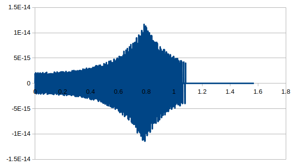

[Moved from](https://837951602.blog.uoj.ac/blog/8830)

Mth.atan2 源码

    public static double atan2(double d, double e) {
        double f = e * e + d * d;
        if (Double.isNaN(f)) {
            return Double.NaN;
        } else {
            boolean bl = d < 0.0;
            if (bl) {
                d = -d;
            }

            boolean bl2 = e < 0.0;
            if (bl2) {
                e = -e;
            }

            boolean bl3 = d > e;
            if (bl3) {
                double g = e;
                e = d;
                d = g;
            }

            double g = fastInvSqrt(f);
            e *= g;
            d *= g;
            double h = FRAC_BIAS + d;
            int i = (int)Double.doubleToRawLongBits(h);
            double j = ASIN_TAB[i];
            double k = COS_TAB[i];
            double l = h - FRAC_BIAS;
            double m = d * k - e * l;
            double n = (6.0 + m * m) * m * 0.16666666666666666;
            double o = j + n;
            if (bl3) {
                o = Math.PI / 2 - o;
            }

            if (bl2) {
                o = Math.PI - o;
            }

            if (bl) {
                o = -o;
            }

            return o;
        }
    }

其中`COS_TAB`其实应该是`COSASIN_TAB[i]`

变量命名得

    double MthAtan2(double y, double x) {
    	double Len2 = y * y + x * x; // Len²
    	if (Len2 != Len2) { // NaN
    		return Len2;
    	}
    	bool NegY = y < 0.0;
    	if (NegY) {
    		y = -y;
    	}
    	bool NegX = x < 0.0;
    	if (NegX) {
    		x = -x;
    	}
    	bool SwapXY = y > x;
    	if (SwapXY) {
    		double t = y; y = x; x = t;
    	}
    	double InvLen = fastInvSqrt(Len2);
    	x *= InvLen;
    	y *= InvLen;
    	// 加上该值可将精度控制为1/256
    	const double FRAC_BIAS = 17592186044416.0;
    	double bias_y = FRAC_BIAS + y;
    	// i = y * 256
    	int i = *(int*)&bias_y;
    	double asinry = ASIN_TAB[i];
    	double cosasinry = COS_TAB[i];
    	double rounded_y = bias_y - FRAC_BIAS;
    	double m = y * cosasinry - x * rounded_y;
    	// m + m^3/6
    	double delta = (6.0 + m * m) * m * (1.0 / 6.0);
    	double ret = asinry + delta;
    	if (SwapXY) {
    		ret = PI / 2 - ret;
    	}
    	if (NegX) {
    		ret = PI - ret;
    	}
    	if (NegY) {
    		ret = - ret;
    	}
    	return ret;
    }

仅分析[0,45°]角，在$\left(x,y\right)$附近查表找到点$\left(\tilde x,\tilde y\right)$，并计算

$$ m = y \cdot \tilde x - x \cdot \tilde y $$ $$ \sin^{-1} y = \sin^{-1} \tilde y + m + \frac{m^3}6 $$

然后就不会了

直接上程序计算，误差为

